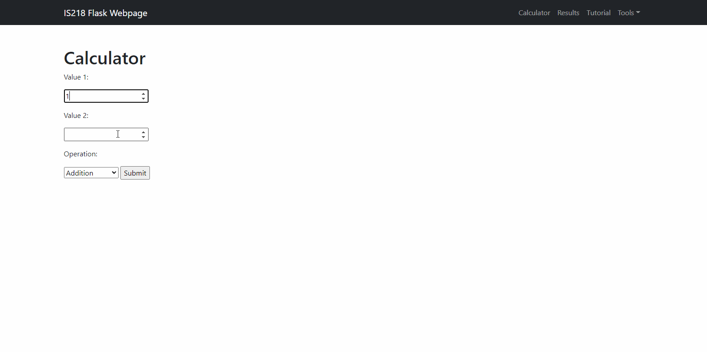

# is218-final

## Youtube Link to Demo Video: https://youtu.be/Dou5u2URpas

##NOTE
I noticed after the fact that this video reflects a bug where calculations appear as duplicates in the results. Here is a gif of the calculator running after the fix:

## Coverage Report:
 
